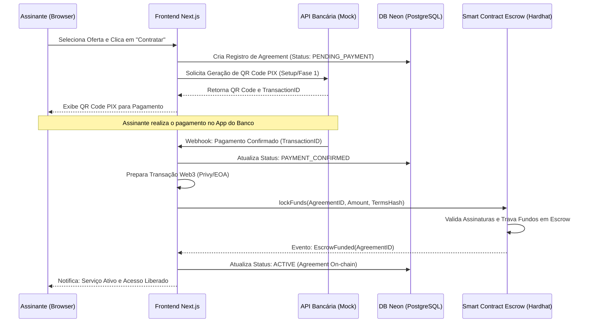
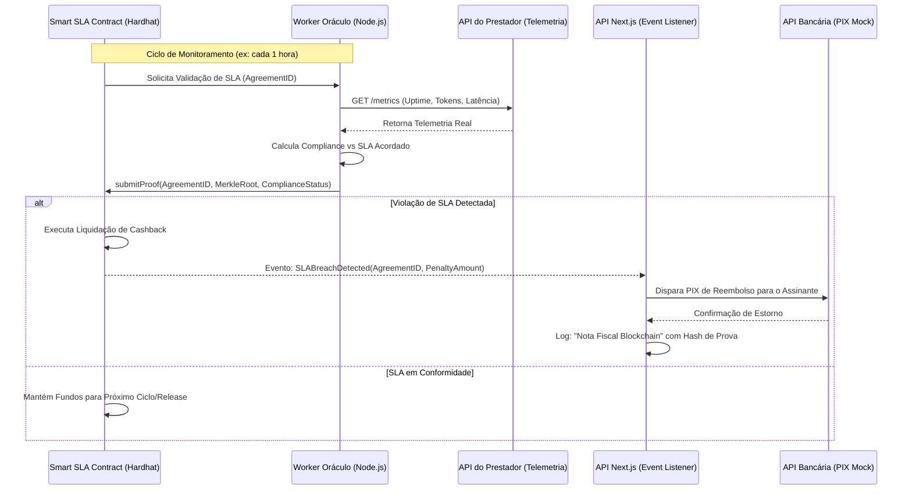
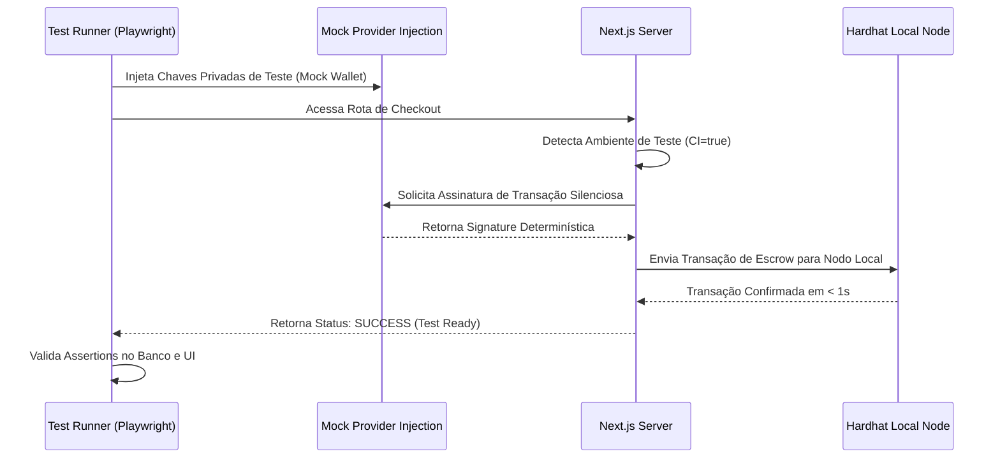

# Visão Global da Arquitetura - HireTrust

O HireTrust é o **Orquestrador de Compromissos (Agreement Orchestrator)** que unifica Identidade Web3, Marketplace de Serviços e Execução Verificável. Esta documentação detalha os fluxos críticos de integração entre as camadas SaaS (Web2) e Blockchain (Web3).

---

## 1. Diagramas de Sequência Ricos

### Fluxo A: Onboarding, Assinatura e Escrow Automático
Este fluxo descreve a jornada desde a escolha do serviço até o travamento de fundos on-chain após a confirmação do pagamento via PIX.

### Fluxo B: Monitoramento de SLA, Oráculo e Resolução de Disputa
Demonstra como a telemetria off-chain impacta a liquidação financeira on-chain de forma automatizada.

### Fluxo C: Ambiente de Testes E2E com Injeção de Provedor
Detalha o bypass da UI manual da Privy para automação de testes determinísticos.

---

## 2. Deep-Dive dos Casos de Uso (Enriquecimento)

### UC-05 & UC-06: Fluxo Financeiro e Escrow (Híbrido)
**Descrição Técnica:** O desafio de sistemas híbridos é a consistência entre o evento financeiro Web2 (PIX) e o estado do Smart Contract Web3. Para garantir a **idempotência**, cada transação financeira gera um `CorrelationID` único persistido no Neon DB.
*   **Mecanismo de Segurança:** Antes de disparar o `lockFunds` no Hardhat, o backend verifica se já existe um `OnChainTxHash` associado ao `CorrelationID`. Se a transação on-chain falhar após o PIX ter sido recebido, um processo de reconciliação assíncrono (Job) tenta novamente o travamento, garantindo que não existam fundos "órfãos" no banco Neon sem proteção on-chain.

### UC-08 a UC-11: SLA Engine & Execução Automática (O "Cartório Digital")
**Descrição Técnica:** O HireTrust atua como um juiz neutro. O cruzamento matemático ocorre na camada do Worker Oráculo, mas o veredito é registrado na Blockchain.
*   **Imutabilidade:** Cada medição de telemetria é convertida em um log estruturado. O hash desse log é enviado ao Smart Contract através do comando `submitProof`.
*   **Impacto Arquitetural:** Isso transforma a blockchain em um "Cartório Digital". Mesmo que o prestador altere seus logs locais, a prova do momento da falha já está ancorada on-chain, tornando a contestação impossível.

### UC-12 & UC-13: Transparência e Auditoria Verificável
**Descrição Técnica:** Para provar que a plataforma SaaS não está manipulando os dashboards de uptime, implementamos a **Validação por Merkle Trees**.
*   **Como funciona:** O Dashboard de Disponibilidade do cliente não lê apenas o banco Neon. Ele realiza um "Challenge" técnico: solicita o `Proof` (Caminho da Merkle Tree) de um evento específico. O frontend então recalcula o hash e o compara com o `MerkleRoot` gravado no Smart Contract durante o ciclo. Se os hashes baterem, o cliente tem a certeza matemática de que o dado visualizado é íntegro e condiz com o que foi acordado.

---

## 3. Arquitetura de Identidade e Acesso (RBAC & Privy)
*   **Web3 Identity:** O login via Privy gera uma Embedded Wallet. No HireTrust, associamos o `PrivyID` ao `WalletAddress` no banco Neon, criando um link indissociável entre a identidade social e a autoridade financeira.
*   **Gatekeeper:** O acesso ao serviço (ex: chaves n8n/Helicone) é liberado apenas se o `EscrowStatus` for `ACTIVE`. Caso o SLA caia abaixo de um nível crítico, o sistema pode suspender o acesso preventivamente até a resolução da disputa.
