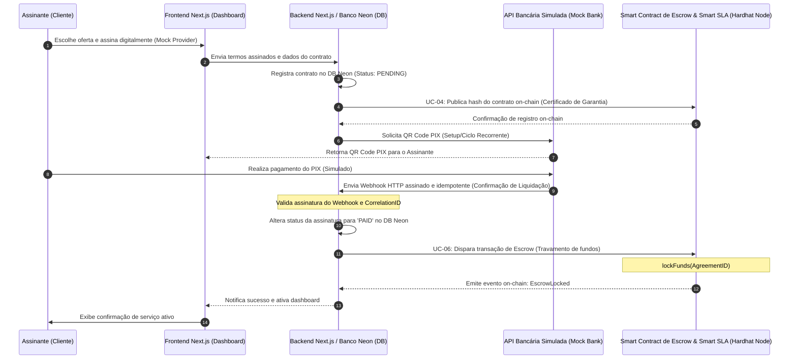
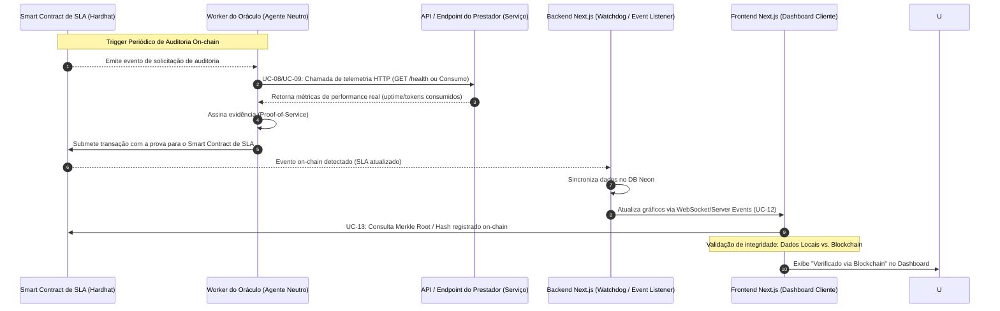
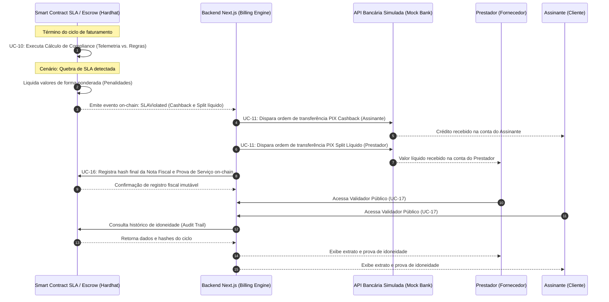

# Visão Global da Arquitetura e Jornadas Técnicas - HireTrust

Esta documentação detalha os fluxos de interação entre os componentes do HireTrust, integrando o ecossistema SaaS (Next.js/Neon) com a infraestrutura Web3 (Hardhat/Smart Contracts).

---

## 1. Diagramas de Sequência de Jornadas Críticas

### DIAGRAMA 1: Jornada do Assinante - Onboarding, Assinatura e Travamento de Escrow
Mapeamento dos fluxos de contratualização e garantia financeira inicial (Etapas 1 e 2).

---

### DIAGRAMA 2: Jornada de Operação - Monitoramento de SLA Engine e Auditoria por Oráculos
Fluxo de verificação neutra e transparência de dados em tempo real (Etapa 3).

---

### DIAGRAMA 3: Jornada do Prestador e Plataforma - Encerramento do Ciclo (Liquidação e Cashback via PIX)
Fechamento de ciclo, cálculo de compliance e execução da justiça financeira automática (Etapa 4).

