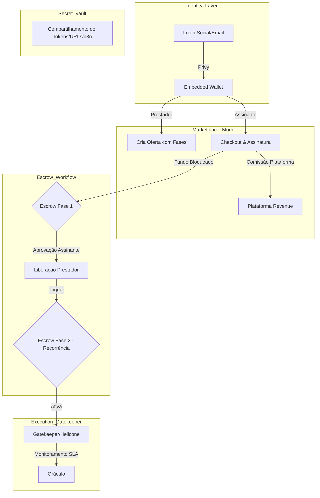

# Visão Global da Arquitetura - HireTrust

O HireTrust é o **Orquestrador de Compromissos (Agreement Orchestrator)** que unifica Identidade Web3, Marketplace de Serviços e Execução Verificável.

## 1. O Fluxo de Valor e Identidade (Privy)

A plataforma utiliza a **Privy** como camada de identidade.
*   **Onboarding Simples:** O usuário faz login via Social/Email e a Privy cria automaticamente uma **Embedded Wallet**.
*   **Identificador Único:** O `WalletAddress` gerado torna-se a identidade primária do Prestador e do Assinante em todo o sistema (On-chain e Off-chain).
*   **Transações Transparentes:** A carteira permite que o usuário assine termos e autorize repasses de forma segura, mantendo a soberania dos fundos.

## 2. O Marketplace e Prova Social (Reviews)

O Marketplace não exibe apenas o preço; ele é um motor de reputação.
*   **Sistema de Avaliações:** Cada ciclo concluído gera um evento de `ReviewRequested`. Notas e comentários são persistidos no Read-Side e ancorados periodicamente on-chain para garantir que a reputação do prestador não possa ser manipulada.
*   **Marketplace Fees:** A comissão da plataforma é retida no momento da venda (Funding do Escrow).

## 3. Fluxo de Trabalho por Etapas (Workflow)

O HireTrust gerencia serviços complexos divididos em fases:

1.  **Fase de Setup (Ex: Consultoria):** Pagamento em Escrow. O prestador trabalha.
2.  **Aprovação:** O assinante revisa a entrega e dispara o comando `ApprovePhase`.
3.  **Liquidação:** O dinheiro da Fase 1 é liberado para o prestador.
4.  **Ativação da Próxima Fase (Ex: Manutenção):** A fase recorrente só inicia após a aprovação da fase anterior.

## 4. O "Secret Vault" (Cofre de Segredos)

Para que o serviço funcione (ex: um fluxo n8n ou acesso a uma conta), ambos precisam compartilhar informações sensíveis.
*   **Vault Compartilhado:** Um ambiente de armazenamento criptografado onde o Prestador e o Assinante podem depositar/consultar URLs, tokens e chaves de acesso particulares necessárias para a execução do serviço.
*   **Segurança:** O acesso ao cofre é vinculado ao `AgreementID` e validado pelas carteiras da Privy de ambos os envolvidos.

## 5. Diagrama Global de Fluxo



## 6. Diagrama de Sequência Detalhado (Fluxo de Aprovação e Vault)

```mermaid
sequence_diagram
    participant U as Assinante (Privy Wallet)
    participant P as Prestador (Privy Wallet)
    participant A as Agreement Module
    participant V as Secret Vault
    participant S as Settlement (Escrow)

    Note over U, P: Acordo assinado e Pago (Fase 1 em Escrow)

    P->>V: StoreCredentials(n8n_URL, Token_ABC)
    V-->>U: Notify Credentials Available

    Note over P: Prestador realiza a Consultoria

    P->>A: MarkPhaseComplete(Fase 1)
    A->>U: RequestPhaseApproval()

    U->>A: ApprovePhase(Fase 1)
    A->>S: ReleaseFunds(Fase 1)
    S-->>P: Payment Transferred

    A->>A: ActivatePhase(Fase 2 - Manutenção)
    A->>S: StartRecurrentBilling()
```

## 7. Máquina de Estados do Contrato (Workflow de Fases)

O Agregado `Agreement` gerencia a transição entre fases através de um workflow rigoroso:

1.  **`DRAFT`**: Acordo sendo montado.
2.  **`SIGNED`**: Assinatura coletada via Privy.
3.  **`FUNDED_PHASE_1`**: Dinheiro da primeira fase no Escrow.
4.  **`IN_PROGRESS_PHASE_1`**: Prestador com acesso ao Vault e trabalhando.
5.  **`COMPLETED_PHASE_1`**: Prestador solicita aprovação.
6.  **`FUNDED_PHASE_2`**: Assinante aprovou, dinheiro liberado, e mensalidade cobrada.
7.  **`ACTIVE_RECURRING`**: Gatekeeper ativo e monitoramento de SLA rodando.

### Comandos Principais:

*   **`ProposeAgreementCommand`**: Define as fases, valores e regras de comissão.
*   **`ApprovePhaseCommand`**: Dispara a liquidação do Escrow da fase atual e o provisionamento da próxima.
*   **`DepositVaultSecretCommand`**: Armazena de forma criptografada as credenciais compartilhadas (URL n8n, tokens).

## 9. Detalhamento de Comandos e Workflow de Aprovação

Abaixo está o detalhamento técnico dos comandos que regem o ciclo de vida de um serviço em duas etapas (Consultoria + Manutenção).

### Fluxo 1: Contratação e Setup (Fase 1)
1.  **`ProposeAgreementCommand`**: O Prestador gera uma proposta.
    *   *Input*: `ProviderID, SubscriberID, Phase1_Price, Phase2_RecurringPrice, CommissionRate, TermsHash`.
    *   *Output*: `AgreementCreatedEvent`.
2.  **`FundEscrowCommand`**: O Assinante realiza o pagamento via Checkout (PIX/Cartão).
    *   *Input*: `AgreementID, TotalAmount`.
    *   *Logic*: Retém `CommissionAmount` e bloqueia o líquido no `EscrowAccount`.
    *   *Output*: `EscrowFundedEvent` -> Ativa status `IN_PROGRESS_PHASE_1`.

### Fluxo 2: Compartilhamento de Credenciais (Secret Vault)
3.  **`DepositSecretCommand`**: O Prestador ou Assinante deposita dados sensíveis.
    *   *Input*: `AgreementID, SecretKey (ex: "N8N_URL"), EncryptedValue`.
    *   *Output*: `SecretStoredEvent`.

### Fluxo 3: Conclusão e Aprovação (Entrega)
4.  **`SubmitPhaseDeliveryCommand`**: O Prestador sinaliza que terminou a Consultoria.
    *   *Input*: `AgreementID, EvidenceLink (ex: Documento de base)`.
    *   *Output*: `PhaseDeliverySubmittedEvent`.
5.  **`ApprovePhaseCommand`**: O Assinante valida e libera o dinheiro.
    *   *Input*: `AgreementID, PhaseNumber`.
    *   *Logic*: Dispara o repasse do Escrow da Fase 1 para a carteira do Prestador e ativa o status `READY_FOR_PHASE_2`.
    *   *Output*: `PhaseApprovedEvent`, `PayoutExecutedEvent`.

### Fluxo 4: Manutenção e Gatekeeper (Fase 2)
6.  **`ActivateRecurringPhaseCommand`**: Ativação automática após a aprovação da Fase 1.
    *   *Logic*: Chama o `ExecutionModule` para gerar a chave no Helicone.
    *   *Output*: `AccessProvisionedEvent`.
