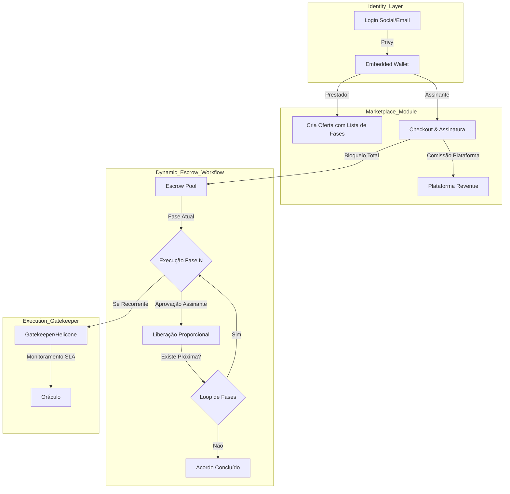
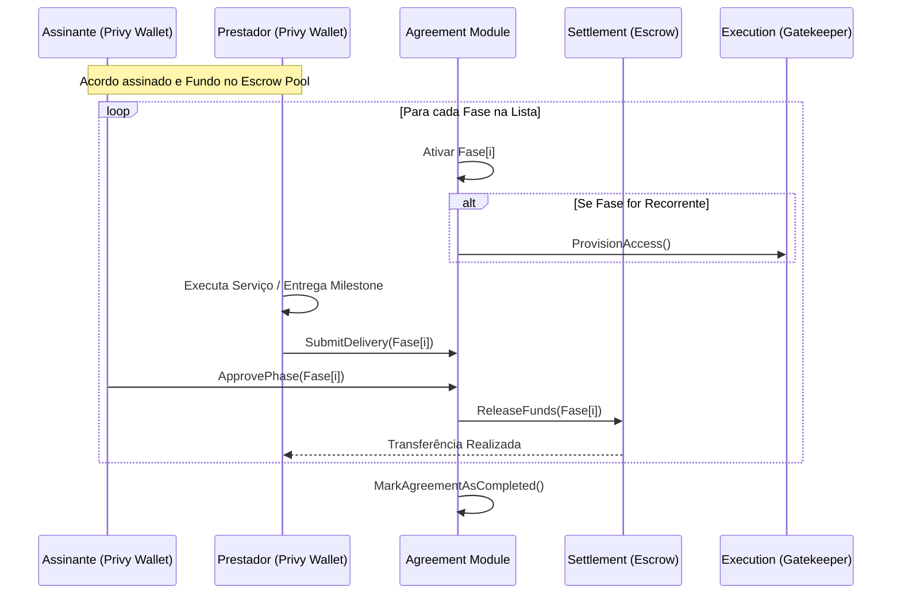

# Visão Global da Arquitetura - HireTrust

O HireTrust é o **Orquestrador de Compromissos (Agreement Orchestrator)** que unifica Identidade Web3, Marketplace de Serviços e Execução Verificável.

## 1. O Fluxo de Valor e Identidade (Privy)

A plataforma utiliza a **Privy** como camada de identidade.
*   **Onboarding Simples:** O usuário faz login via Social/Email e a Privy cria automaticamente uma **Embedded Wallet**.
*   **Identificador Único:** O `WalletAddress` gerado torna-se a identidade primária do Prestador e do Assinante em todo o sistema (On-chain e Off-chain).
*   **Transações Transparentes:** A carteira permite que o usuário assine termos e autorize repasses de forma segura, mantendo a soberania dos fundos.

## 2. O Marketplace e Prova Social (Reviews)

O Marketplace não exibe apenas o preço; ele é um motor de reputação.
*   **Sistema de Avaliações:** Cada ciclo concluído gera um evento de `ReviewRequested`. Notas e comentários são persistidos no Read-Side e ancorados periodicamente on-chain para garantir que a reputação do prestador não possa ser manipulada.
*   **Marketplace Fees:** A comissão da plataforma é retida no momento da venda (Funding do Escrow).

## 3. Fluxo de Trabalho Dinâmico (Multi-Phase Workflow)

O HireTrust gerencia serviços complexos através de uma coleção dinâmica de fases. Não há um limite fixo para o número ou tipo de etapas:

1.  **Definição de Fases:** O prestador define uma lista de `ServicePhase` (ex: Setup, Milestone 1, Milestone 2, Manutenção Recorrente).
2.  **Gatilho de Execução:** Cada fase possui seu próprio `Escrow` e condições de liberação.
3.  **Aprovação e Sequenciamento:** O assinante aprova a entrega de uma fase, liberando os fundos e ativando automaticamente a próxima fase da fila.

## 4. O "Secret Vault" (Cofre de Segredos)

Para que o serviço funcione, as partes compartilham informações sensíveis no Vault.
*   **Vault Compartilhado:** Ambiente criptografado associado ao `AgreementID`.
*   **Acesso Controlado:** O acesso às credenciais (URLs n8n, tokens, logins) é liberado conforme o status das fases ativas.

## 5. Diagrama Global de Fluxo (Dinâmico)

## 6. Diagrama de Sequência Detalhado (Iteração de Fases)

## 7. Máquina de Estados da Fase (ServicePhase)

Cada fase dentro de um acordo segue seu próprio ciclo de vida:

1.  **`PENDING`**: Aguardando a conclusão da fase anterior.
2.  **`FUNDED`**: Recursos garantidos no pool de escrow.
3.  **`IN_PROGRESS`**: Prestador autorizado a executar.
4.  **`REVIEW_REQUESTED`**: Entrega submetida para avaliação.
5.  **`COMPLETED`**: Aprovada pelo assinante e fundos liberados.

## 8. Detalhamento de Comandos (Escalável)

*   **`ProposeAgreementCommand`**:
    *   *Input*: `ProviderID, SubscriberID, Phases[], TermsHash`.
    *   *Phases Array*: `[{ name: "Setup", price: 1500, type: "FIXED" }, { name: "Manutenção", price: 80, type: "RECURRING" }]`.
*   **`ApprovePhaseCommand`**:
    *   *Input*: `AgreementID, PhaseIndex`.
    *   *Logic*: Move o ponteiro `currentPhaseIndex` para o próximo item após a liquidação.
