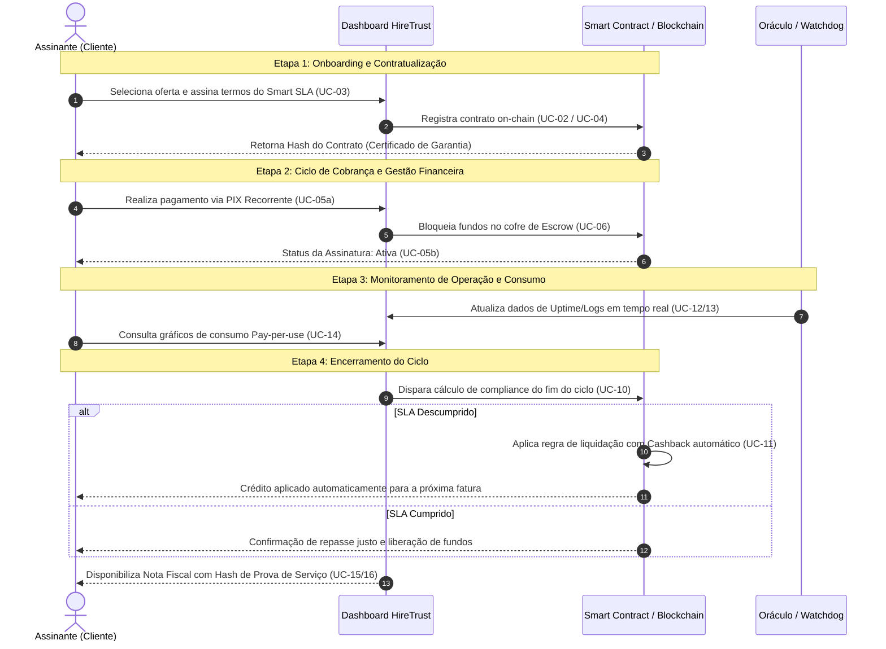
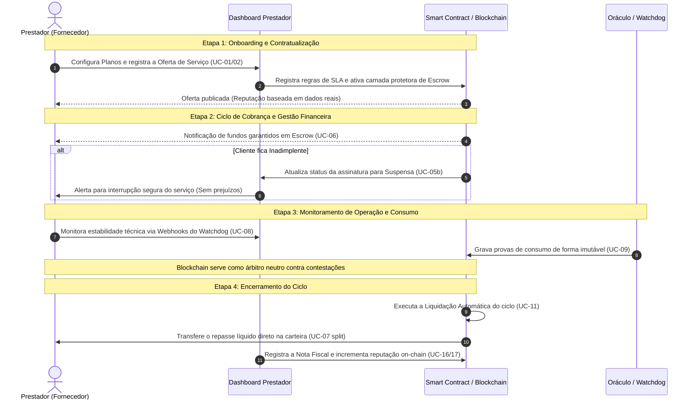
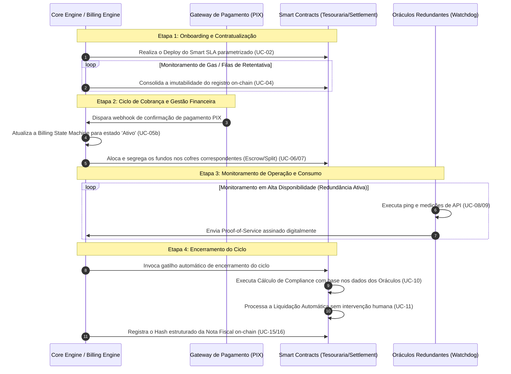

# Jornadas do Usuário - HireTrust

Este documento detalha as jornadas dos três atores principais da plataforma HireTrust, mapeando seus objetivos, ações (Casos de Uso), pontos de contato, fatores de confiança e gestão de riscos.

---

## 1. Jornada do Assinante (Cliente)

### Etapa 1: Onboarding e Contratualização

* **Objetivo:** Contratar um serviço com garantias reais de entrega, sem burocracia e com segurança jurídica/tecnológica.
* **Casos de Uso Associados:** UC-02 (Smart SLA), UC-03 (Assinatura da Oferta), UC-04 (Registro On-chain).
* **Touchpoints:** Marketplace/Dashboard HireTrust, Carteira Digital (Assinatura), Explorer Blockchain.
* **Trust Points:** Visualização do hash do contrato na Blockchain como um "Certificado de Garantia" imutável antes do início do serviço.
* **Risco/Frustração:** Insegurança sobre os termos do SLA. O sistema resolve gerando um Smart SLA padronizado onde as regras de cashback são auditáveis e imutáveis (Code is Law).

### Etapa 2: Ciclo de Cobrança e Gestão Financeira

* **Objetivo:** Manter o serviço ativo de forma prática e automatizada, garantindo que o pagamento esteja protegido até a prova de entrega.
* **Casos de Uso Associados:** UC-05a (Setup), UC-05b (Ciclo Recorrente), UC-06 (Escrow).
* **Touchpoints:** App de Banco (PIX Recorrente), Dashboard Financeiro (Status da Assinatura).
* **Trust Points:** O valor pago fica retido em **Escrow**; a paz de espírito vem de saber que o dinheiro não é liberado se o serviço falhar.
* **Risco/Frustração:** Esquecer de pagar o boleto/PIX. O sistema resolve com o fluxo de PIX prático (agendado/recorrente) e notificações proativas de status (Ativa/Suspensa).

### Etapa 3: Monitoramento de Operação e Consumo

* **Objetivo:** Acompanhar em tempo real a performance do fornecedor e o consumo de recursos (Pay-per-use).
* **Casos de Uso Associados:** UC-12 (Painel de Gestão), UC-13 (Auditoria Verificável), UC-14 (Relatório de Consumo).
* **Touchpoints:** Dashboard de Performance (Gráficos de Uptime), Logs em Tempo Real.
* **Trust Points:** Os dados de monitoramento vêm de Oráculos neutros, eliminando a "palavra do prestador" como única fonte de verdade.
* **Risco/Frustração:** Queda de serviço sem aviso. O sistema monitora via Watchdog e reflete a queda instantaneamente no dashboard, disparando o gatilho de conformidade.

### Etapa 4: Encerramento do Ciclo (Auditoria, Repasse ou Cashback)

* **Objetivo:** Validar o fechamento do mês, confirmar o repasse justo e obter o documento fiscal.
* **Casos de Uso Associados:** UC-10 (Cálculo de Compliance), UC-11 (Liquidação Automática), UC-15 (Prova de Serviço), UC-16 (Nota Fiscal On-chain).
* **Touchpoints:** Dashboard de Fechamento, Explorer Blockchain (Validador Público).
* **Trust Points:** Recebimento automático de **crédito para o próximo ciclo** caso o SLA tenha sido descumprido; acesso à Nota Fiscal com hash vinculado à prova de serviço.
* **Risco/Frustração:** Pagar por um serviço que não funcionou. O sistema resolve com o cálculo automático de cashback aplicado diretamente na próxima fatura.

### Diagrama de Sequência: Jornada do Assinante

---

## 2. Jornada do Prestador (Fornecedor)

### Etapa 1: Onboarding e Contratualização

* **Objetivo:** Publicar ofertas de serviço com regras claras para atrair clientes que buscam alta performance.
* **Casos de Uso Associados:** UC-01 (Registro de Oferta), UC-02 (Configuração de Planos).
* **Touchpoints:** Dashboard do Prestador, Configuração de Endpoints de Monitoramento.
* **Trust Points:** A reputação do prestador é construída sobre dados reais on-chain, servindo como diferencial competitivo de mercado.
* **Risco/Frustração:** Baixa conversão por falta de confiança do cliente. O HireTrust resolve ao oferecer a camada de Escrow que garante o pagamento ao prestador se ele performar.

### Etapa 2: Ciclo de Cobrança e Gestão Financeira

* **Objetivo:** Garantir a previsibilidade de caixa e a segurança de que o cliente já pagou (valor em Escrow).
* **Casos de Uso Associados:** UC-06 (Escrow), UC-07 (Split de Receita).
* **Touchpoints:** Dashboard Financeiro, Notificações de Novos Assinantes.
* **Trust Points:** Visualização transparente dos fundos "garantidos" em Escrow e do split de taxas da plataforma.
* **Risco/Frustração:** Inadimplência do cliente. O sistema suspende automaticamente o serviço (UC-05b), protegendo o prestador de trabalhar sem garantia financeira.

### Etapa 3: Monitoramento de Operação e Consumo

* **Objetivo:** Garantir que sua infraestrutura esteja saudável para assegurar o recebimento integral do ciclo.
* **Casos de Uso Associados:** UC-08 (Watchdog), UC-09 (Auditoria de Consumo).
* **Touchpoints:** Dashboard de Saúde Técnica, Webhooks de Alerta de SLA.
* **Trust Points:** Alinhamento técnico total com os Oráculos; provas de consumo imutáveis evitam contestações indevidas do cliente sobre uso variável.
* **Risco/Frustração:** Divergência de métricas com o cliente. O sistema resolve usando a Blockchain como "árbitro" neutro dos dados coletados.

### Etapa 4: Encerramento do Ciclo (Auditoria, Repasse ou Cashback)

* **Objetivo:** Receber o repasse líquido, emitir a Nota Fiscal e consolidar sua reputação pública.
* **Casos de Uso Associados:** UC-11 (Liquidação), UC-16 (Nota Fiscal Blockchain), UC-17 (Validador Público).
* **Touchpoints:** Extrato de Liquidação, Registro de Reputação On-chain.
* **Trust Points:** Repasse automático imediato após o fechamento do ciclo; a Nota Fiscal registrada na Blockchain prova sua idoneidade fiscal e técnica.
* **Risco/Frustração:** Atraso no repasse manual. O sistema resolve via automação total do Smart Contract de liquidação ao fim do ciclo de faturamento.

### Diagrama de Sequência: Jornada do Prestador

---

## 3. Jornada de Operação da Plataforma & Oráculos

### Etapa 1: Onboarding e Contratualização

* **Objetivo:** Orquestrar o registro imutável dos acordos e garantir que as chaves de monitoramento estejam ativas.
* **Casos de Uso Associados:** UC-02 (Smart SLA), UC-04 (Registro On-chain).
* **Touchpoints:** Core Engine da Plataforma, Smart Contracts (Deploy).
* **Trust Points:** Garantia de que cada assinatura gera um registro único e verificável no "Cartório Digital" (Blockchain).
* **Risco/Frustração:** Falha na publicação on-chain. O sistema utiliza filas de retentativa e monitoramento de gas para assegurar a imutabilidade.

### Etapa 2: Ciclo de Cobrança e Gestão Financeira

* **Objetivo:** Automatizar a Billing State Machine (Ativa/Suspensa/Cancelada) e gerenciar os cofres de Escrow.
* **Casos de Uso Associados:** UC-05b (Motor de Assinaturas), UC-06 (Escrow), UC-07 (Split de Risco).
* **Touchpoints:** Gateway de Pagamento (PIX), Smart Contracts de Tesouraria.
* **Trust Points:** Segregação total de fundos entre taxas da plataforma, receita do prestador e fundo de cashback.
* **Risco/Frustração:** Falha no split de valores. A plataforma resolve usando regras codificadas em Smart Contracts auditáveis, eliminando erro humano.

### Etapa 3: Monitoramento de Operação e Consumo

* **Objetivo:** Atuar como o observador neutro que coleta evidências irrefutáveis de disponibilidade e uso.
* **Casos de Uso Associados:** UC-08 (Watchdog), UC-09 (Medição de Consumo).
* **Touchpoints:** Oráculos de Uptime, Agentes de Monitoramento de API.
* **Trust Points:** Assinatura digital das provas de serviço (Proof-of-Service) a cada "check" realizado pelos Oráculos.
* **Risco/Frustração:** Downtime do monitoramento. A infraestrutura utiliza redundância de Oráculos para garantir que a verificação nunca pare.

### Etapa 4: Encerramento do Ciclo (Auditoria, Repasse ou Cashback)

* **Objetivo:** Processar o cálculo de conformidade e executar a liquidação final com emissão de evidências.
* **Casos de Uso Associados:** UC-10 (Cálculo de Compliance), UC-11 (Liquidação Automática), UC-15 (Prova de Serviço), UC-16 (Registro da Nota).
* **Touchpoints:** Billing Engine, Smart Contracts de Settlement.
* **Trust Points:** Automação 100% na resolução: se SLA < acordado, cashback = crédito imediato para o assinante.
* **Risco/Frustração:** Disputas sobre o valor final. O sistema resolve através da transparência total do Dashboard Verificável (UC-12/13), onde todos os dados que levaram à liquidação são públicos para as partes interessadas.

### Diagrama de Sequência: Jornada da Operação & Oráculos

